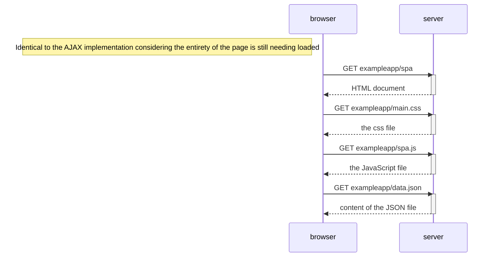

```mermaid
sequenceDiagram
    participant browser
    participant server

    Note left of browser: Identical to the AJAX implementation considering the entirety of the page is still needing loaded

    browser->>server: GET exampleapp/spa
    activate server
    server-->>browser: HTML document
    deactivate server

    browser->>server: GET exampleapp/main.css
    activate server
    server-->>browser: the css file
    deactivate server

    browser->>server: GET exampleapp/spa.js
    activate server
    server-->>browser: the JavaScript file
    deactivate server

    browser->>server: GET exampleapp/data.json
    activate server
    server-->>browser: content of the JSON file
    deactivate server
```